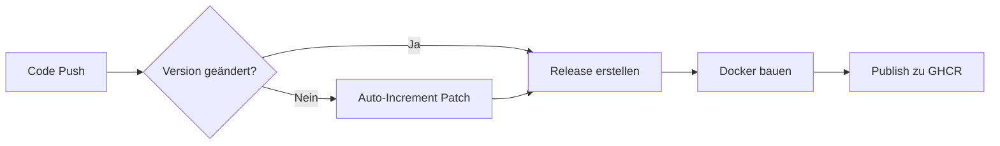

<div align="center">


# 🚀 WSB-Crawler

[](https://github.com/fgrfn/reddit-wsb-crawler/releases)
[](https://github.com/fgrfn/reddit-wsb-crawler/pkgs/container/reddit-wsb-crawler)
[](LICENSE)
[](https://www.python.org/downloads/)
[](https://github.com/fgrfn/reddit-wsb-crawler/actions)

**Automatisches Frühwarnsystem für Reddit-Aktien-Hypes**

Crawlt r/wallstreetbets nach Ticker-Erwähnungen, analysiert Trends und sendet Discord-Alerts bei ungewöhnlicher Aktivität.

[Features](#-features) • [Quick Start](#-quick-start) • [Docker](#-docker-empfohlen) • [Konfiguration](#-konfiguration) • [Dokumentation](#-dokumentation)

</div>

---

## ✨ Features

### 🔍 **Intelligentes Crawling**
- Durchsucht konfigurierbare Subreddits (wallstreetbets, wallstreetbetsGER, etc.)
- Regex-basierte Ticker-Erkennung in Posts & Kommentaren
- Parallel-Processing für schnelle Analyse
- Deduplizierung und Blacklist-Filter

### 📊 **Umfassende Datenanalyse**
- **Kursdaten**: Live-Kurse + Pre/After-Market von Yahoo Finance
- **Trend-Analyse**: 1h, 24h, 7d Kursveränderungen
- **News-Integration**: Aktuelle Headlines via NewsAPI
- **Historischer Vergleich**: Erkennt signifikante Anstiege

### 🔔 **Smart Alerts**
- Discord-Benachrichtigungen bei ungewöhnlicher Aktivität
- Konfigurierbare Schwellwerte (Nennungen, Kursänderungen)
- Kompaktes Format mit allen relevanten Infos
- Silent Status-Updates (Heartbeat ohne Ping)

### 🐳 **Production-Ready**
- Vollständige Docker-Unterstützung
- Automatische Releases via GitHub Actions
- Semantic Versioning mit Auto-Increment
- Persistente Daten & Caching

## 🚀 Quick Start

### Option 1: Docker (empfohlen)

```bash
# Pre-built Image von GitHub Container Registry
docker pull ghcr.io/fgrfn/reddit-wsb-crawler:latest

# Oder mit spezifischer Version
docker pull ghcr.io/fgrfn/reddit-wsb-crawler:v1.0.1
```

**Alternativ: Selbst bauen**

```bash
# 1. Repository klonen
git clone https://github.com/fgrfn/reddit-wsb-crawler.git
cd reddit-wsb-crawler

# 2. Config erstellen
cp config/.env.example config/.env
nano config/.env  # API-Keys eintragen

# 3. Mit Docker Compose starten
docker-compose up -d

# 4. Logs anschauen
docker-compose logs -f
```

### Option 2: Python (lokal)
### Option 2: Python (lokal)

```bash
# 1. Repository klonen
git clone https://github.com/fgrfn/reddit-wsb-crawler.git
cd reddit-wsb-crawler

# 2. Virtual Environment
python -m venv venv
source venv/bin/activate  # Windows: venv\Scripts\activate

# 3. Dependencies installieren
pip install -r requirements.txt

# 4. Config erstellen
cp config/.env.example config/.env
nano config/.env  # API-Keys eintragen

# 5. Crawler starten
python src/run_crawler_headless.py
```

---

## ⚙️ Konfiguration

#### Erforderliche Credentials:

| Variable | Beschreibung | Wo bekomme ich das? |
|----------|--------------|---------------------|
| `REDDIT_CLIENT_ID` | Reddit API Client ID | [reddit.com/prefs/apps](https://www.reddit.com/prefs/apps) |
| `REDDIT_CLIENT_SECRET` | Reddit API Secret | [reddit.com/prefs/apps](https://www.reddit.com/prefs/apps) |
| `REDDIT_USER_AGENT` | User Agent String | z.B. `python:wsb-crawler:v1.0.0 (by /u/your_username)` |
| `NEWSAPI_KEY` | NewsAPI Key | [newsapi.org/register](https://newsapi.org/register) |
| `DISCORD_WEBHOOK_URL` | Discord Webhook URL | Discord Server Settings → Integrations → Webhooks |

#### Optionale Einstellungen:

```ini
# Subreddits (komma-separiert)
SUBREDDITS=wallstreetbets,wallstreetbetsGER,mauerstrassenwetten

# News-Einstellungen
NEWSAPI_LANG=en           # Sprache für News (en, de, etc.)
NEWSAPI_WINDOW_HOURS=48   # Zeitfenster für News in Stunden

---

## 📂 Projektstruktur

```
reddit-wsb-crawler/
├── src/                              # Quellcode
│   ├── run_crawler_headless.py      # Haupt-Entry-Point (vollautomatisch)
│   ├── main_crawler.py              # Legacy-Version (einfacher)
│   ├── reddit_crawler.py            # Reddit-Crawling-Logik
│   ├── ticker_resolver.py           # Ticker → Unternehmensnamen
│   ├── summarize_ticker.py          # Zusammenfassungen erstellen
│   ├── discord_utils.py             # Discord-Benachrichtigungen
│   ├── ticker_utils.py              # Tickerlist-Verwaltung
│   ├── __version__.py               # Version-Info
│   └── scripts/
│       └── test_discord_message.py  # Discord-Test-Tool
├── data/                             # Persistente Daten
│   ├── input/                       # Ticker-Listen & Caches
│   ├── output/                      # Crawl-Ergebnisse & Summaries
│   └── state/                       # Alert-States
├── logs/                             # Log-Dateien
├── config/                           # Konfiguration
│   ├── .env                         # Deine Credentials (nicht in Git!)
│   └── .env.example                 # Vorlage
├── Dockerfile                        # Docker-Image
├── docker-compose.yml               # Docker Orchestration
└── requirements.txt                 # Python-Dependencies
```

## 💡 Verwendung

---

## 📱 Discord-Alarm-Format

Die Alerts sind kompakt und informativ gestaltet:

```
⚠️ WSB-ALARM — Ungewöhnliche Aktivität entdeckt
💾 260202-143022_crawler-ergebnis.pkl
⏰ 02.02.2026 14:30:22

🥇 GME - GameStop Corp. 🚨
🔢 Nennungen: 127 (Δ +85)
💵 42.50 USD (+2.30 USD, +5.73%) 📈 [02.02.2026 14:28]
    | 🌅 Pre-Market: 41.80 USD | 🌙 After-Market: 42.90 USD
    | Trends: 1h ▲ +1.2% · 24h ▲ +5.7% · 7d ▼ -2.3%
    | https://finance.yahoo.com/quote/GME
🧠 Kurs: 42.50 USD (Δ +2.30, +5.73%). Aktuelle Headlines: ...
📰 GameStop rallies on new NFT marketplace (Reuters) | https://...
📰 Analysts upgrade GME price target (Bloomberg) | https://...
---
```

### Alert-Bedingungen

Ein Alert wird ausgelöst, wenn:

- **Neue Ticker:** ≥ 20 Nennungen (konfigurierbar: `ALERT_MIN_ABS`)
- **Bekannte Ticker:** 
  - Anstieg ≥ 10 Nennungen (`ALERT_MIN_DELTA`)
  - **UND** ≥ 200% des vorherigen Werts (`ALERT_RATIO`)
- Optional: Kursveränderung ≥ 5% (`ALERT_MIN_PRICE_MOVE`)

Pro Crawl werden max. 3 Alerts gesendet (`ALERT_MAX_PER_RUN`) mit 4h Cooldown pro Ticker (`ALERT_COOLDOWN_H`)
cp config/.env.example config/.env
nano config/.env

---

## � Docker

### Pre-built Images

Das Projekt stellt automatisch gebaute Docker Images bereit:

| Tag | Beschreibung | Verwendung |
|-----|--------------|------------|
| `latest` | Neueste Version vom main branch | Empfohlen für Production |
| `v1.0.1` | Spezifische Release-Version | Für Reproduzierbarkeit |
| `v1.0` | Minor-Version (automatisch) | Latest Patch einer Minor-Version |

```bash
# Latest Version
docker pull ghcr.io/fgrfn/reddit-wsb-crawler:latest
docker run --env-file config/.env \
  -v $(pwd)/data:/app/data \
  -v $(pwd)/logs:/app/logs \
  ghcr.io/fgrfn/reddit-wsb-crawler:latest

# Spezifische Version für Reproduzierbarkeit
docker pull ghcr.io/fgrfn/reddit-wsb-crawler:v1.0.1
```

### Docker Compose (empfohlen)

Das Repo enthält ein vollständiges `docker-compose.yml` mit allen Konfigurationen.

**1. Einmalig ausführen:**
```bash
# Mit lokalem Build
docker-compose up

# Mit Pre-built Image
docker-compose -f docker-compose.prod.yml up
```

**2. Mit Scheduler (regelmäßige Crawls):**
```bash
# Führt Crawler im Intervall aus (Standard: alle 60 Minuten)
docker-compose --profile scheduler up -d

# Logs anschauen
docker-compose logs -f wsb-crawler-scheduler

# Intervall anpassen (z.B. 15 Minuten)
CRAWL_INTERVAL=900 docker-compose --profile scheduler up -d
```

**3. Beispiel `docker-compose.prod.yml`:**
```yaml
version: '3.8'

services:
  wsb-crawler:
    image: ghcr.io/fgrfn/reddit-wsb-crawler:latest
    container_name: wsb-crawler
    restart: unless-stopped
    
    environment:
      - TZ=Europe/Berlin
    
    env_file:
      - config/.env
    
    volumes:
      - ./data:/app/data
      - ./logs:/app/logs
      - ./config/.env:/app/config/.env:ro
    
    logging:
      driver: "json-file"
      options:
        max-size: "10m"
        max-file: "3"
```

### Erforderliche Environment-Variablen

Erstelle `config/.env` mit folgenden Variablen:

**Pflicht-Felder:**
```bash
# Reddit API (https://www.reddit.com/prefs/apps)
REDDIT_CLIENT_ID=your_client_id_here
REDDIT_CLIENT_SECRET=your_client_secret_here
REDDIT_USER_AGENT=python:wsb-crawler:v1.0.0 (by /u/yourusername)

# NewsAPI (https://newsapi.org/register)
NEWSAPI_KEY=your_newsapi_key_here

# Discord Webhook
DISCORD_WEBHOOK_URL=https://discord.com/api/webhooks/YOUR_WEBHOOK_URL
```

**Optional (mit Defaults):**
```bash
# Subreddits (komma-separiert)
SUBREDDITS=wallstreetbets,wallstreetbetsGER

# News-Einstellungen
NEWSAPI_LANG=en                # Sprache (en, de, fr, etc.)
NEWSAPI_WINDOW_HOURS=48        # Zeitfenster für News

# Discord Status-Updates
DISCORD_STATUS_UPDATE=true     # Silent Status (ohne @everyone)

# Alert-Schwellwerte
ALERT_MIN_ABS=20              # Min. Nennungen für neue Ticker
ALERT_MIN_DELTA=10            # Min. Anstieg für bekannte Ticker
ALERT_RATIO=2.0               # Min. Faktor (200% des Vorwerts)
ALERT_MIN_PRICE_MOVE=5.0      # Min. Kursänderung in %
ALERT_MAX_PER_RUN=3           # Max. Alerts pro Crawl
ALERT_COOLDOWN_H=4            # Cooldown pro Ticker in Stunden

# Scheduler (nur für --profile scheduler)
CRAWL_INTERVAL=3600           # Intervall in Sekunden (60 Min.)
```

Vollständige Vorlage: [`config/.env.example`](config/.env.example)

Mehr Details: [DOCKER.md](DOCKER.md)

---

## �🔄 Versioning & Releases

Das Projekt nutzt [Semantic Versioning](https://semver.org/) mit **vollautomatischem Release-Management**.

### Automatischer Workflow

Bei jedem Push auf `main`:



1. **Version-Check**: Prüft ob `version.txt` manuell geändert wurde
2. **Auto-Increment**: Erhöht Patch-Version (1.0.0 → 1.0.1) falls nicht
3. **Release**: Erstellt GitHub Release mit automatischem Changelog
4. **Docker**: Baut und pusht Image zu `ghcr.io/fgrfn/reddit-wsb-crawler`

### Version manuell erhöhen

Für Features oder Breaking Changes:

```bash
# Feature-Release (1.0.0 → 1.1.0)
echo "1.1.0" > version.txt
sed -i 's/__version__ = ".*"/__version__ = "1.1.0"/' src/__version__.py
sed -i 's/version=".*"/version="1.1.0"/' Dockerfile
git commit -am "feat: neue Feature-Beschreibung"
git push

# Breaking Change (1.1.0 → 2.0.0)
echo "2.0.0" > version.txt
sed -i 's/__version__ = ".*"/__version__ = "2.0.0"/' src/__version__.py
sed -i 's/version=".*"/version="2.0.0"/' Dockerfile
git commit -am "feat!: breaking change Beschreibung"
git push
```

**Aktuelle Version:** 1.0.0 | [Alle Releases →](https://github.com/fgrfn/reddit-wsb-crawler/releases)

---

## 📖 Dokumentation

| Dokument | Beschreibung |
|----------|--------------|
| [DOCKER.md](DOCKER.md) | Umfassende Docker-Anleitung mit Best Practices |
| [CHANGELOG.md](CHANGELOG.md) | Vollständige Versions-Historie |
| [SETUP_COMPLETE.md](SETUP_COMPLETE.md) | Detaillierte Setup-Übersicht |
| [REFACTORING_SUMMARY.md](REFACTORING_SUMMARY.md) | Code-Refactoring Details |

---

## 🛠️ Development

### Lokales Setup

```bash
# Repository klonen
git clone https://github.com/fgrfn/reddit-wsb-crawler.git
cd reddit-wsb-crawler

# Virtual Environment
python -m venv venv
source venv/bin/activate

# Dependencies installieren
pip install -r requirements.txt

# Pre-commit hooks (optional)
pip install pre-commit
pre-commit install
```

### Mit Docker entwickeln

```bash
# Development Container starten
docker-compose -f docker-compose.dev.yml up -d

# In Container einloggen
docker exec -it wsb-crawler-dev bash

# Im Container arbeiten
python src/run_crawler_headless.py
```

### Tests

```bash
# Einzelne Komponenten testen
python src/scripts/test_discord_message.py

# Ticker-Auflösung testen
python src/build_ticker_name_cache.py

# Interaktive Suche
python src/check_ticker_mentions.py
```

---

## 🤝 Contributing

Beiträge sind willkommen! So kannst du helfen:

### Pull Request erstellen

1. **Fork** das Repository
2. **Branch** erstellen: `git checkout -b feature/amazing-feature`
3. **Commit** mit [Conventional Commits](https://www.conventionalcommits.org/):
   - `feat:` für neue Features
   - `fix:` für Bugfixes
   - `docs:` für Dokumentation
   - `chore:` für Wartungsarbeiten
4. **Push**: `git push origin feature/amazing-feature`
5. **Pull Request** öffnen

### Code-Qualität

- Type Hints für alle Funktionen
- Docstrings für öffentliche APIs
- Tests für neue Features
- Docker-Kompatibilität sicherstellen

---

## 📊 Monitoring & Logs

### Logs ansehen

```bash
# Docker
docker-compose logs -f
docker-compose logs --tail=50 wsb-crawler

# Lokal
tail -f logs/crawler.log
```

### Log-Dateien

- `logs/crawler.log` - Hauptlog
- `logs/resolver.log` - Ticker-Namensauflösung
- `logs/openai_costs.log` - API-Kosten (falls verwendet)
- `logs/archive/` - Archivierte Logs

### Debugging

```bash
# Fehlerhafte Pickle-Dateien prüfen
ls -la data/output/pickle/

# Cache leeren
rm data/input/ticker_name_map.pkl

# Ticker-Listen neu laden
python -c "from src.ticker_utils import download_and_clean_tickerlist; download_and_clean_tickerlist()"
```

---

## 🔒 Security

### Best Practices

- **Nie** `.env`-Dateien committen!
- API-Keys in GitHub Secrets für CI/CD
- Docker Secrets für Production
- Regelmäßige Dependency-Updates

### Secrets Management

```bash
# Für Production: Docker Secrets
echo "my_secret_key" | docker secret create reddit_client_secret -

# In docker-compose.yml
secrets:
  - reddit_client_secret
```

---

## 📝 License

MIT License - siehe [LICENSE](LICENSE)

---

## 🙏 Credits

- **Reddit API**: [PRAW](https://praw.readthedocs.io/)
- **Kursdaten**: [yfinance](https://github.com/ranaroussi/yfinance)
- **News**: [NewsAPI](https://newsapi.org/)
- **Discord**: [Webhooks](https://discord.com/developers/docs/resources/webhook)

---

## 💬 Support

- **Issues**: [GitHub Issues](https://github.com/fgrfn/reddit-wsb-crawler/issues)
- **Discussions**: [GitHub Discussions](https://github.com/fgrfn/reddit-wsb-crawler/discussions)
- **Discord**: [Server beitreten](#) _(falls vorhanden)_

---

<div align="center">

**Entwickelt mit ❤️ für die WSB-Community**

⭐ Wenn dir dieses Projekt gefällt, gib uns einen Star!

[⬆ Nach oben](#-wsb-crawler)

</div>

```bash
# Alle 30 Minuten
CRAWL_INTERVAL=1800 docker-compose --profile scheduler up -d

# Alle 2 Stunden
CRAWL_INTERVAL=7200 docker-compose --profile scheduler up -d
```

### Development Mode

```bash
# Live-Reload für Code-Änderungen
docker-compose -f docker-compose.dev.yml up -d
docker exec -it wsb-crawler-dev bash

# Im Container
python src/run_crawler_headless.py
```

📚 **Mehr Details:** Siehe [DOCKER.md](DOCKER.md)

---

## ⚙️ Konfiguration

### Basis-Setup
Lege `config/.env` im Repo‑Root an (empfohlen). Minimales Beispiel:
```ini
# Reddit
REDDIT_CLIENT_ID=...
REDDIT_CLIENT_SECRET=...
REDDIT_USER_AGENT=python:wsb-crawler:v1.0 (by /u/you)
SUBREDDITS=wallstreetbets,wallstreetbetsGER

# NewsAPI (erforderlich für Headlines)
NEWSAPI_KEY=dein_newsapi_key
NEWSAPI_LANG=en
NEWSAPI_WINDOW_HOURS=48

# Discord
DISCORD_WEBHOOK_URL=https://discord.com/api/webhooks/...

# Alert thresholds (Beispiele)
ALERT_MIN_ABS=20
ALERT_MIN_DELTA=10
ALERT_RATIO=2.0
ALERT_MIN_PRICE_MOVE=5.0
ALERT_MAX_PER_RUN=3
ALERT_COOLDOWN_H=4
```
Hinweis: `config/.env` (Repo‑Root) wird bevorzugt; es gibt Fallbacks (`src/config/.env`, `./config/.env`).

## 🐳 Docker (empfohlen)

Schnellster Weg zum Starten:

```bash
# 1. Config erstellen
cp config/.env.example config/.env
# Bearbeite config/.env mit deinen API-Keys

# 2. Container starten
docker-compose up --build

# Oder mit Scheduler (stündliche Crawls)
docker-compose --profile scheduler up -d
```

Siehe [DOCKER.md](DOCKER.md) für Details.

## Schnellstart / Befehle
- Voller Headless‑Crawl:
```bash
python src/run_crawler_headless.py
```
- Lokale Discord‑Preview (nutzt neueste Pickle):
```bash
python src/scripts/test_discord_message.py --use-real
```
- Preview + senden (benötigt gültigen `DISCORD_WEBHOOK_URL`):
```bash
python src/scripts/test_discord_message.py --use-real --send
```

## Dateistruktur (wichtig)
- data/input/ — Tickerlisten & Caches (`ticker_name_map.pkl`, `all_tickers.csv`)
- data/output/pickle/ — Crawl‑Pickles (z. B. `251030-000011_crawler-ergebnis.pkl`)
- data/output/summaries/ — generierte Zusammenfassungen (.md)
- data/state/ — persistenter Alert‑State (z. B. `alerts.json`)
- src/ — Quellcode (crawler, summarizer, discord utils, scripts)

## Discord‑Alarm‑Format
Kompakte Alert‑Nachricht enthält:
- Kopf (⚠️ WSB‑ALARM) + Pickle‑Name (💾 ...)
- Zeitstempel
- Top‑Ticker (bis 3) mit Nennungen, Δ, Kurszeile (inkl. Pre/After‑Market), Trends (1h/24h/7d), Yahoo‑Link
- Kurz‑Summary + bis zu 3 News‑Headlines (Titel | Quelle | URL)

Ziel: schnelle visuelle Erkennung von plötzlichen Nennungs‑/Trend‑Anstiegen.

## Testen von News‑Fetch
Beispiel: NewsAPI‑Abruf prüfen:
```bash
python - <<'PY'
import sys
from pathlib import Path
sys.path.insert(0, str(Path.cwd()/'src'))
from summarize_ticker import get_yf_news
import json
print(json.dumps(get_yf_news("BYND"), ensure_ascii=False, indent=2))
PY
```

## Alert‑Logik (Kurz)
Empfohlene, konfigurierte Schwellen (ENV):
- ALERT_MIN_ABS, ALERT_MIN_DELTA, ALERT_RATIO, ALERT_MIN_PRICE_MOVE, ALERT_MAX_PER_RUN, ALERT_COOLDOWN_H  
Vorschlag: Score‑basierter Filter + per‑Ticker Cooldown; Ergebnisse persistent in `data/state/alerts.json`.

## Weiteres / Anpassungen
- `src/scripts/test_discord_message.py` erzeugt eine Vorschau‑Nachricht; mit `--use-real` nutzt es die letzte Crawl‑Pickle.

## 🔄 Updates & Versioning

Das Projekt nutzt [Semantic Versioning](https://semver.org/). Bei jedem Push auf `main` wird automatisch:
1. Die Version in `version.txt` um 0.0.1 erhöht
2. Ein GitHub Release mit Changelog erstellt
3. Ein Docker-Image gebaut und in die GitHub Container Registry gepusht

**Aktuelle Version:** 1.0.0

Siehe [CHANGELOG.md](CHANGELOG.md) für Details zu allen Versionen.

## 📖 Weitere Dokumentation

- [DOCKER.md](DOCKER.md) - Docker Setup und Best Practices
- [REFACTORING_SUMMARY.md](REFACTORING_SUMMARY.md) - Code-Refactoring Details
- [CHANGELOG.md](CHANGELOG.md) - Versions-Historie

## 🤝 Contributing

1. Fork das Repository
2. Erstelle einen Feature-Branch (`git checkout -b feature/amazing-feature`)
3. Commit deine Änderungen (`git commit -m 'feat: add amazing feature'`)
4. Push zum Branch (`git push origin feature/amazing-feature`)
5. Öffne einen Pull Request

## 📝 License

MIT License - siehe [LICENSE](LICENSE) für Details.
- `src/summarize_ticker.py` erzeugt strukturierte Summaries: `{"summary": "...", "news": [...]}`.
- Änderbare Parameter via ENV (ALERT_*, NEWSAPI_*).

## Troubleshooting
- Keine News angezeigt:
  - Prüfe `NEWSAPI_KEY` in `config/.env` und Rate‑Limits von NewsAPI.
  - Stelle `NEWSAPI_WINDOW_HOURS` ggf. auf ein größeres Fenster.
- yfinance Errors (z. B. ungültige period):
  - Achte auf gültige `period`/`interval`-Kombinationen (`1d`, `5d`, `1mo`, ...).
- Falsche/alte Version importiert:
```bash
find . -name "__pycache__" -exec rm -rf {} +
python - <<'PY'
import inspect, sys
sys.path.insert(0, "src")
import discord_utils
print(discord_utils.__file__)
PY
```
- Logs prüfen:
  - `logs/` (falls vorhanden) oder stdout der service/cron Unit.
- Alerts werden zu häufig gesendet:
  - Erhöhe `ALERT_COOLDOWN_H`, `ALERT_MIN_ABS`, `ALERT_MIN_DELTA` oder senke `ALERT_MAX_PER_RUN`.

## Lizenz
MIT

