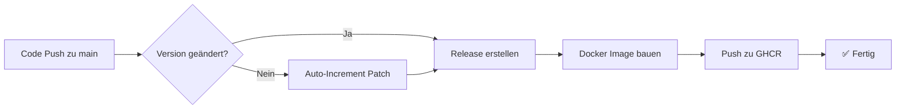

# 🚀 WSB-Crawler v1.0.0 - Setup Complete!

## ✅ Was wurde implementiert:

### 1️⃣ **Versionierung** ✅
- Version **1.0.0** im Code implementiert
- [`src/__version__.py`](src/__version__.py) - Zentrale Version-Verwaltung
- [`version.txt`](version.txt) - Einfache Version-Datei für CI/CD
- Version wird in allen Hauptskripten geloggt

### 2️⃣ **Automatisches Release-System** ✅
- **GitHub Actions Workflow**: [`.github/workflows/release.yml`](.github/workflows/release.yml)
- Automatisches Release bei jedem Push auf `main`
- Changelog-Generierung aus Git-Commits
- Docker-Image-Build und Push zu GitHub Container Registry

### 3️⃣ **Auto-Increment der Versionsnummer** ✅
- Bei jedem Code-Push wird Patch-Version erhöht (1.0.0 → 1.0.1 → 1.0.2)
- Automatisches Update von:
  - `version.txt`
  - `src/__version__.py`
  - `Dockerfile` LABEL
- Commit mit `[skip ci]` um Endlos-Loops zu vermeiden

### 4️⃣ **Docker-Support** ✅
- **Production**: [`Dockerfile`](Dockerfile) - Optimiertes Multi-Stage Build
- **Orchestration**: [`docker-compose.yml`](docker-compose.yml) - Mit Scheduler-Option
- **Development**: [`docker-compose.dev.yml`](docker-compose.dev.yml) - Live-Reload
- **Ignore**: [`.dockerignore`](.dockerignore) - Optimierte Build-Größe

## 📁 Neue Dateien:

```
reddit-wsb-crawler/
├── src/__version__.py              # Version-Verwaltung
├── version.txt                     # Simple Version (für CI)
├── Dockerfile                      # Production Docker-Image
├── docker-compose.yml              # Orchestration
├── docker-compose.dev.yml          # Development Setup
├── .dockerignore                   # Docker Build-Optimierung
├── setup.sh                        # Quick-Setup Script
├── config/.env.example             # Beispiel-Konfiguration
├── LICENSE                         # MIT License
├── CHANGELOG.md                    # Versions-Historie
├── DOCKER.md                       # Docker-Dokumentation
└── .github/workflows/
    ├── release.yml                 # Automatisches Release + Docker
    └── docker-test.yml             # Docker Build Tests für PRs
```

## 🔄 Workflow-Übersicht:



## 🎯 Wie es funktioniert:

### **Bei jedem Push auf `main`:**

1. **Version-Check**
   - Prüft ob `version.txt` manuell geändert wurde
   - Falls nein → Auto-Increment Patch-Version

2. **Version-Update**
   - Erhöht Version (z.B. 1.0.0 → 1.0.1)
   - Updated alle Version-Referenzen
   - Committed mit `[skip ci]` Tag

3. **Release erstellen**
   - Erstellt Git-Tag (v1.0.1)
   - Generiert Changelog aus Commits
   - Erstellt GitHub Release

4. **Docker Build**
   - Baut Docker-Image
   - Tagged als `latest` und `v1.0.1`
   - Pushed zu `ghcr.io/fgrfn/reddit-wsb-crawler`

## 🐳 Docker Quick-Start:

```bash
# 1. Setup (einmalig)
./setup.sh

# 2. Einmaliger Crawl
docker-compose up

# 3. Mit Scheduler (stündlich, Hintergrund)
docker-compose --profile scheduler up -d

# 4. Vom Registry pullen (nach Release)
docker pull ghcr.io/fgrfn/reddit-wsb-crawler:latest
```

## 📊 Version-Strategie:

- **Major** (1.x.x): Breaking Changes, API-Änderungen
- **Minor** (x.1.x): Neue Features, keine Breaking Changes
- **Patch** (x.x.1): Bugfixes, kleine Verbesserungen (Auto-Increment)

### Manuelle Version-Erhöhung:

```bash
# Feature-Release
echo "1.1.0" > version.txt
sed -i 's/__version__ = ".*"/__version__ = "1.1.0"/' src/__version__.py
sed -i 's/version=".*"/version="1.1.0"/' Dockerfile
git add version.txt src/__version__.py Dockerfile
git commit -m "feat: bump to v1.1.0 - new feature XYZ"
git push
```

## 🔍 Monitoring:

### GitHub Actions
- [Actions Tab](../../actions) - Workflow-Status
- [Releases](../../releases) - Alle Releases
- [Packages](../../pkgs/container/reddit-wsb-crawler) - Docker Images

### Lokale Version prüfen
```bash
python -c "from src.__version__ import __version__; print(__version__)"
```

### Docker Image Version
```bash
docker run --rm ghcr.io/fgrfn/reddit-wsb-crawler:latest \
  python -c "from src.__version__ import __version__; print(__version__)"
```

## 🛠️ Troubleshooting:

### Workflow schlägt fehl
- Check [Actions](../../actions) für Fehler-Details
- Oft: Permissions für GitHub Token
- Fix: Settings → Actions → General → Workflow permissions → "Read and write"

### Docker Build Fehler
- Lokal testen: `docker-compose build`
- Logs: `docker-compose logs`
- Cache leeren: `docker-compose build --no-cache`

### Version-Conflict
- Manuelle Version immer in allen 3 Dateien synchron halten
- Bei Unsicherheit: Auto-Increment nutzen

## 📚 Dokumentation:

- [README.md](README.md) - Haupt-Dokumentation
- [DOCKER.md](DOCKER.md) - Docker Best Practices
- [CHANGELOG.md](CHANGELOG.md) - Versions-Historie
- [REFACTORING_SUMMARY.md](REFACTORING_SUMMARY.md) - Code-Refactoring

## 🎉 Nächste Schritte:

1. **Config erstellen**: Kopiere `config/.env.example` → `config/.env`
2. **Credentials hinzufügen**: Reddit API, NewsAPI, Discord Webhook
3. **Lokal testen**: `docker-compose up`
4. **Pushen**: Automatisches Release wird erstellt! 🚀

---

**Ready to launch! 🚀**
